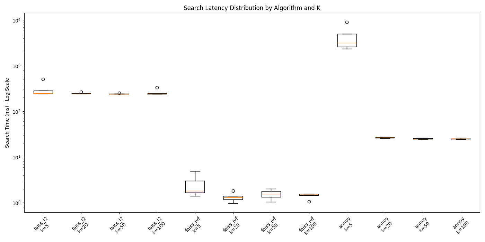

# KNN Algorithms Comparison Summary

## FAISS IVF Configuration
- **nlist (Clusters Trained)**: 6843
- **nprobe (Clusters Searched)**: 10

## Latency Distribution

## Results per K

### K = 5

| Query | faiss_l2 L2 Sum | faiss_l2 Time (ms) | faiss_l2 Avg Int. Sim | faiss_ivf L2 Sum | faiss_ivf Time (ms) | faiss_ivf Avg Int. Sim | % L2 Diff | Speedup | annoy L2 Sum | annoy Time (ms) | annoy Avg Int. Sim | % L2 Diff | Speedup | 
| :--- | :---: | :---: | :---: | :---: | :---: | :---: | :---: | :---: | :---: | :---: | :---: | :---: | :---: | 
| Socrates | 2.8776 | 505.249 | 0.6634 | 2.9036 | 4.923 | 0.6504 | 0.90% | 102.63x | 2.8776 | 9097.386 | 0.6634 | 0.00% | 0.06x | 
| Aristotle | 2.1007 | 243.662 | 0.6987 | 2.1007 | 3.032 | 0.6987 | 0.00% | 80.36x | 2.1007 | 4998.983 | 0.6987 | 0.00% | 0.05x | 
| Pericles | 2.4000 | 285.148 | 0.6979 | 2.4000 | 1.400 | 0.6979 | 0.00% | 203.66x | 2.4000 | 3167.324 | 0.6979 | 0.00% | 0.09x | 
| Acropolis | 1.6963 | 243.025 | 0.6042 | 1.6963 | 1.815 | 0.6042 | 0.00% | 133.94x | 1.6963 | 2356.754 | 0.6042 | 0.00% | 0.10x | 
| Parthenon | 2.0133 | 246.677 | 0.6409 | 2.0176 | 1.670 | 0.6722 | 0.21% | 147.73x | 2.0133 | 2616.807 | 0.6409 | 0.00% | 0.09x | 

**Summary Statistics (k=5)**

- **faiss_l2** - Avg Time: 304.752 ms, Avg Internal Sim: 0.6610
- **faiss_ivf** - Avg Time: 2.568 ms (Speedup: 118.68x), Avg Internal Sim: 0.6647, Avg Accuracy Loss: 0.22%
- **annoy** - Avg Time: 4447.451 ms (Speedup: 0.07x), Avg Internal Sim: 0.6610, Avg Accuracy Loss: 0.00%

---

### K = 20

| Query | faiss_l2 L2 Sum | faiss_l2 Time (ms) | faiss_l2 Avg Int. Sim | faiss_ivf L2 Sum | faiss_ivf Time (ms) | faiss_ivf Avg Int. Sim | % L2 Diff | Speedup | annoy L2 Sum | annoy Time (ms) | annoy Avg Int. Sim | % L2 Diff | Speedup | 
| :--- | :---: | :---: | :---: | :---: | :---: | :---: | :---: | :---: | :---: | :---: | :---: | :---: | :---: | 
| Socrates | 15.8120 | 266.128 | 0.7182 | 16.1245 | 1.805 | 0.6255 | 1.98% | 147.41x | 15.8150 | 26.986 | 0.7209 | 0.02% | 9.86x | 
| Aristotle | 14.3478 | 248.609 | 0.7107 | 14.4843 | 1.294 | 0.7377 | 0.95% | 192.17x | 14.4652 | 27.749 | 0.7126 | 0.82% | 8.96x | 
| Pericles | 13.3880 | 245.133 | 0.7341 | 13.4127 | 0.968 | 0.7717 | 0.18% | 253.13x | 13.3880 | 26.476 | 0.7341 | -0.00% | 9.26x | 
| Acropolis | 12.3698 | 245.915 | 0.6998 | 14.0950 | 1.395 | 0.6698 | 13.95% | 176.31x | 12.3698 | 25.681 | 0.6998 | 0.00% | 9.58x | 
| Parthenon | 10.4785 | 242.675 | 0.6090 | 10.6373 | 1.166 | 0.6239 | 1.52% | 208.05x | 10.5780 | 26.327 | 0.6108 | 0.95% | 9.22x | 

**Summary Statistics (k=20)**

- **faiss_l2** - Avg Time: 249.692 ms, Avg Internal Sim: 0.6943
- **faiss_ivf** - Avg Time: 1.326 ms (Speedup: 188.34x), Avg Internal Sim: 0.6857, Avg Accuracy Loss: 3.71%
- **annoy** - Avg Time: 26.644 ms (Speedup: 9.37x), Avg Internal Sim: 0.6956, Avg Accuracy Loss: 0.36%

---

### K = 50

| Query | faiss_l2 L2 Sum | faiss_l2 Time (ms) | faiss_l2 Avg Int. Sim | faiss_ivf L2 Sum | faiss_ivf Time (ms) | faiss_ivf Avg Int. Sim | % L2 Diff | Speedup | annoy L2 Sum | annoy Time (ms) | annoy Avg Int. Sim | % L2 Diff | Speedup | 
| :--- | :---: | :---: | :---: | :---: | :---: | :---: | :---: | :---: | :---: | :---: | :---: | :---: | :---: | 
| Socrates | 43.2467 | 250.985 | 0.7369 | 44.0631 | 2.025 | 0.6714 | 1.89% | 123.97x | 43.3566 | 26.295 | 0.7364 | 0.25% | 9.55x | 
| Aristotle | 42.3442 | 240.222 | 0.7385 | 42.7071 | 1.794 | 0.7029 | 0.86% | 133.90x | 42.8244 | 24.635 | 0.7367 | 1.13% | 9.75x | 
| Pericles | 36.5053 | 240.694 | 0.7696 | 36.5582 | 1.042 | 0.7761 | 0.14% | 230.90x | 36.5254 | 24.791 | 0.7659 | 0.06% | 9.71x | 
| Acropolis | 38.0080 | 243.789 | 0.7227 | 41.5777 | 1.561 | 0.7107 | 9.39% | 156.18x | 38.1998 | 24.731 | 0.7253 | 0.50% | 9.86x | 
| Parthenon | 30.1312 | 238.713 | 0.6635 | 30.7120 | 1.328 | 0.6695 | 1.93% | 179.77x | 32.0235 | 25.895 | 0.6166 | 6.28% | 9.22x | 

**Summary Statistics (k=50)**

- **faiss_l2** - Avg Time: 242.881 ms, Avg Internal Sim: 0.7262
- **faiss_ivf** - Avg Time: 1.550 ms (Speedup: 156.70x), Avg Internal Sim: 0.7061, Avg Accuracy Loss: 2.84%
- **annoy** - Avg Time: 25.269 ms (Speedup: 9.61x), Avg Internal Sim: 0.7162, Avg Accuracy Loss: 1.65%

---

### K = 100

| Query | faiss_l2 L2 Sum | faiss_l2 Time (ms) | faiss_l2 Avg Int. Sim | faiss_ivf L2 Sum | faiss_ivf Time (ms) | faiss_ivf Avg Int. Sim | % L2 Diff | Speedup | annoy L2 Sum | annoy Time (ms) | annoy Avg Int. Sim | % L2 Diff | Speedup | 
| :--- | :---: | :---: | :---: | :---: | :---: | :---: | :---: | :---: | :---: | :---: | :---: | :---: | :---: | 
| Socrates | 90.5582 | 335.827 | 0.7563 | 92.5087 | 1.560 | 0.7328 | 2.15% | 215.30x | 91.1266 | 26.223 | 0.7585 | 0.63% | 12.81x | 
| Aristotle | 90.2546 | 239.556 | 0.7387 | 91.1186 | 1.559 | 0.6806 | 0.96% | 153.69x | 91.5170 | 24.696 | 0.7477 | 1.40% | 9.70x | 
| Pericles | 76.0042 | 244.521 | 0.7422 | 76.0796 | 1.458 | 0.7630 | 0.10% | 167.66x | 76.0629 | 24.578 | 0.7390 | 0.08% | 9.95x | 
| Acropolis | 83.2385 | 246.883 | 0.7524 | 89.2438 | 1.509 | 0.7813 | 7.21% | 163.62x | 84.1667 | 25.345 | 0.7486 | 1.12% | 9.74x | 
| Parthenon | 68.2006 | 240.731 | 0.6428 | 69.7954 | 1.058 | 0.7261 | 2.34% | 227.49x | 75.4650 | 25.388 | 0.7210 | 10.65% | 9.48x | 

**Summary Statistics (k=100)**

- **faiss_l2** - Avg Time: 261.504 ms, Avg Internal Sim: 0.7265
- **faiss_ivf** - Avg Time: 1.429 ms (Speedup: 183.02x), Avg Internal Sim: 0.7368, Avg Accuracy Loss: 2.55%
- **annoy** - Avg Time: 25.246 ms (Speedup: 10.36x), Avg Internal Sim: 0.7430, Avg Accuracy Loss: 2.77%

---

